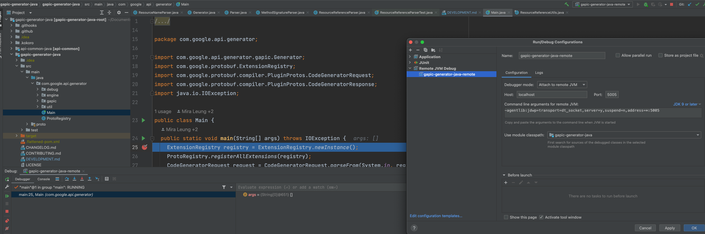

# Development Workflow

## Test Running

### Unit Tests

To run the unit tests in `gapic-generator-java` submodule, first build all
modules with `mvn -pl '!gapic-generator-java' install -DskipTests` at the root
directory,
then `cd` into `gapic-generator-java` submodule for the following commands:

- Run all unit tests:

  ```sh
  # In gapic-generator-java submodule
  mvn test
  ```

- Run a single or multiple unit tests:

  ```sh
  # In gapic-generator-java submodule
  mvn test -Dtest=JavaCodeGeneratorTest

  mvn test "-Dtest=Basic*, !%regex[.*.Unstable.*], !%regex[.*.MyTest.class#one.*|two.*], %regex[#fast.*|slow.*]"
  ```

- Update all unit test golden files:

  ```sh
  # In gapic-generator-java submodule
  mvn test -DupdateUnitGoldens
  ```

- Update a single unit test golden file, for example `JavaCodeGeneratorTest.java`:

  ```sh
  # In gapic-generator-java submodule
  mvn test -DupdateUnitGoldens -Dtest=JavaCodeGeneratorTest
  ```

Note that `mvn -pl '!gapic-generator-java' install -DskipTests`
at the root directory is needed for `mvn test` commands,
because the gapic-generator-java submodule depends on the "test jars" of
gax-java. The test jars are absent until Maven's "package" phase, which is later
than the "test" phase.

### Integration Tests

To run integration test for gapic-generator-java, run this Bazel command in the
root of the repository (where you have WORKSPACE file for Bazel.)

```sh
# In the repository root directory
bazelisk test //...  # integration tests
```


- Run a single integration test for API like `Redis`, it generates Java source
  code using the Java microgenerator and compares them with the goldens files
  in `test/integration/goldens/redis`.

    ```sh
    # In the repository root directory
    bazelisk test //test/integration:redis
    ```

- Update integration test golden files, for example `Redis`. This clobbers all the
  files in `test/integration/goldens/redis`.

    ```sh
    # In the repository root directory
    bazelisk run //test/integration:update_redis
    ```

## Running the Plugin under googleapis with local gapic-generator-java

For running the Plugin with showcase protos and local gapic-generator-java, see
[Showcase Integration Testing](../showcase/README.md).

To generate a production GAPIC API:

1. Clone [googleapis](https://github.com/googleapis/googleapis).

2. Modify `googleapis/WORKSPACE` to point to local gapic-generator-java

   Normally, googleapis's build pulls in gapic-generator-java from Maven Central.
   For a local run, we first need to build a local SNAPSHOT jar of the generator. Then we point googleapis to
   both the local SNAPSHOT jar and the local copy of the generator.

   Replace the following section in googleapis
   ```
    _gapic_generator_java_version = "2.13.0"

    maven_install(
        artifacts = [
            "com.google.api:gapic-generator-java:" + _gapic_generator_java_version,
        ],
        #Update this False for local development
        fail_on_missing_checksum = True,
        repositories = [
            "m2Local",
            "https://repo.maven.apache.org/maven2/",
        ]
    )
    
    http_archive(
        name = "gapic_generator_java",
        strip_prefix = "gapic-generator-java-%s" % _gapic_generator_java_version,
        urls = ["https://github.com/googleapis/gapic-generator-java/archive/v%s.zip" % _gapic_generator_java_version],
    )
    
    # gax-java is part of gapic-generator-java repository
    http_archive(
        name = "com_google_api_gax_java",
        strip_prefix = "gapic-generator-java-%s/gax-java" % _gapic_generator_java_version,
        urls = ["https://github.com/googleapis/gapic-generator-java/archive/v%s.zip" % _gapic_generator_java_version],
    )
   ```

   to
   ```
    _gapic_generator_java_version = "2.15.4-SNAPSHOT"
    
    maven_install(
        artifacts = [
            "com.google.api:gapic-generator-java:" + _gapic_generator_java_version,
        ],
        #Update this False for local development
        fail_on_missing_checksum = False,
        repositories = [
            "m2Local",
            "https://repo.maven.apache.org/maven2/",
        ]
    )
    
    local_repository(
        name = "gapic_generator_java",
        path = "/absolute/path/to/your/local/gapic-generator-java",
    )
    
    # gax-java is part of gapic-generator-java repository
    local_repository(
        name = "com_google_api_gax_java",
        path = "/absolute/path/to/your/local/gapic-generator-java/gax-java",
    )
   ```

   Note: At the time of writing, the gapic-generator version was `2.13.0`. Update the version to the latest version in the pom.xml

3. Build the new target.

   You can generate any client library based on the protos within googleapis.
   You just need the name of the service within the `java_gapic_assembly_gradle_pkg`
   rules within the service's `BUILD.bazel` file.
   For instance, to run your local generator on the `speech`'s v2 service, you can
   run:

   ```
   bazelisk build //google/cloud/speech/v2:google-cloud-speech-v2-java
   ```

   Note: If you are running into bazel build issues, you can try to remove gapic-generator-java cached in your local m2
   Try running this command:
   ```
    rm -rf ~/.m2/repository/com/google/api/
   ```
   and then rebuild gapic-generator-java (`mvn clean install`).

## Debugging the gapic-generator-java running on protobuf compiler

1. In [googleapis](https://github.com/googleapis/googleapis) root directory, run the following commands:
   1. Set `JVM_DEBUG_PORT` environment variable.
       ```shell
       export JVM_DEBUG_PORT=5005
       ```
      The protobuf compiler runs the `protoc-gen-java_gapic` shell script (a wrapper of java command with an option to specify JVM debugging). 
      We set the environment variable `JVM_DEBUG_PORT` to enable the debug option.

   2. Run the command to build a client library, e.g., `java-monitoring`, with `--subcommands` flag to output commands spawned by `bazel build`.
      ```shell
      bazel build --subcommands //google/monitoring/v3:google-cloud-monitoring-v3-java
      ```
   3. In the output, find the command of protobuf compiler invocation with gapic-generator-java plugin (the `darwin_arm64-opt-exec-2B5CBBC6` part may be different on your environment).
      
      Note that different client libraries have different proto files.
      ```shell
      bazel-out/darwin_arm64-opt-exec-2B5CBBC6/bin/external/com_google_protobuf/protoc --experimental_allow_proto3_optional '--plugin=protoc-gen-java_gapic=bazel-out/darwin_arm64-opt-exec-2B5CBBC6/bin/external/gapic_generator_java/protoc-gen-java_gapic' '--java_gapic_out=metadata:bazel-out/darwin_arm64-fastbuild/bin/google/monitoring/v3/monitoring_java_gapic_srcjar_raw.srcjar.zip' '--java_gapic_opt=transport=grpc,rest-numeric-enums,grpc-service-config=google/monitoring/v3/monitoring_grpc_service_config.json,gapic-config=google/monitoring/v3/monitoring_gapic.yaml,api-service-config=google/monitoring/v3/monitoring.yaml' '-Igoogle/monitoring/v3/alert.proto=google/monitoring/v3/alert.proto' '-Igoogle/monitoring/v3/alert_service.proto=google/monitoring/v3/alert_service.proto' '-Igoogle/monitoring/v3/common.proto=google/monitoring/v3/common.proto' '-Igoogle/monitoring/v3/dropped_labels.proto=google/monitoring/v3/dropped_labels.proto' '-Igoogle/monitoring/v3/group.proto=google/monitoring/v3/group.proto' '-Igoogle/monitoring/v3/group_service.proto=google/monitoring/v3/group_service.proto' '-Igoogle/monitoring/v3/metric.proto=google/monitoring/v3/metric.proto' '-Igoogle/monitoring/v3/metric_service.proto=google/monitoring/v3/metric_service.proto' '-Igoogle/monitoring/v3/mutation_record.proto=google/monitoring/v3/mutation_record.proto' '-Igoogle/monitoring/v3/notification.proto=google/monitoring/v3/notification.proto' '-Igoogle/monitoring/v3/notification_service.proto=google/monitoring/v3/notification_service.proto' '-Igoogle/monitoring/v3/query_service.proto=google/monitoring/v3/query_service.proto' '-Igoogle/monitoring/v3/service.proto=google/monitoring/v3/service.proto' '-Igoogle/monitoring/v3/service_service.proto=google/monitoring/v3/service_service.proto' '-Igoogle/monitoring/v3/snooze.proto=google/monitoring/v3/snooze.proto' '-Igoogle/monitoring/v3/snooze_service.proto=google/monitoring/v3/snooze_service.proto' '-Igoogle/monitoring/v3/span_context.proto=google/monitoring/v3/span_context.proto' '-Igoogle/monitoring/v3/uptime.proto=google/monitoring/v3/uptime.proto' '-Igoogle/monitoring/v3/uptime_service.proto=google/monitoring/v3/uptime_service.proto' '-Igoogle/api/annotations.proto=google/api/annotations.proto' '-Igoogle/api/http.proto=google/api/http.proto' '-Igoogle/protobuf/descriptor.proto=bazel-out/darwin_arm64-fastbuild/bin/external/com_google_protobuf/_virtual_imports/descriptor_proto/google/protobuf/descriptor.proto' '-Igoogle/api/client.proto=google/api/client.proto' '-Igoogle/api/launch_stage.proto=google/api/launch_stage.proto' '-Igoogle/protobuf/duration.proto=bazel-out/darwin_arm64-fastbuild/bin/external/com_google_protobuf/_virtual_imports/duration_proto/google/protobuf/duration.proto' '-Igoogle/api/distribution.proto=google/api/distribution.proto' '-Igoogle/protobuf/any.proto=bazel-out/darwin_arm64-fastbuild/bin/external/com_google_protobuf/_virtual_imports/any_proto/google/protobuf/any.proto' '-Igoogle/protobuf/timestamp.proto=bazel-out/darwin_arm64-fastbuild/bin/external/com_google_protobuf/_virtual_imports/timestamp_proto/google/protobuf/timestamp.proto' '-Igoogle/api/field_behavior.proto=google/api/field_behavior.proto' '-Igoogle/api/label.proto=google/api/label.proto' '-Igoogle/api/metric.proto=google/api/metric.proto' '-Igoogle/api/monitored_resource.proto=google/api/monitored_resource.proto' '-Igoogle/protobuf/struct.proto=bazel-out/darwin_arm64-fastbuild/bin/external/com_google_protobuf/_virtual_imports/struct_proto/google/protobuf/struct.proto' '-Igoogle/api/resource.proto=google/api/resource.proto' '-Igoogle/rpc/status.proto=google/rpc/status.proto' '-Igoogle/type/calendar_period.proto=google/type/calendar_period.proto' '-Igoogle/protobuf/empty.proto=bazel-out/darwin_arm64-fastbuild/bin/external/com_google_protobuf/_virtual_imports/empty_proto/google/protobuf/empty.proto' '-Igoogle/protobuf/field_mask.proto=bazel-out/darwin_arm64-fastbuild/bin/external/com_google_protobuf/_virtual_imports/field_mask_proto/google/protobuf/field_mask.proto' '-Igoogle/protobuf/wrappers.proto=bazel-out/darwin_arm64-fastbuild/bin/external/com_google_protobuf/_virtual_imports/wrappers_proto/google/protobuf/wrappers.proto' '-Igoogle/cloud/common_resources.proto=google/cloud/common_resources.proto' google/monitoring/v3/alert.proto google/monitoring/v3/alert_service.proto google/monitoring/v3/common.proto google/monitoring/v3/dropped_labels.proto google/monitoring/v3/group.proto google/monitoring/v3/group_service.proto google/monitoring/v3/metric.proto google/monitoring/v3/metric_service.proto google/monitoring/v3/mutation_record.proto google/monitoring/v3/notification.proto google/monitoring/v3/notification_service.proto google/monitoring/v3/query_service.proto google/monitoring/v3/service.proto google/monitoring/v3/service_service.proto google/monitoring/v3/snooze.proto google/monitoring/v3/snooze_service.proto google/monitoring/v3/span_context.proto google/monitoring/v3/uptime.proto google/monitoring/v3/uptime_service.proto google/cloud/common_resources.proto
      ```
   4. Run the protoc command.
      
      It shows nothing because it's waiting for a debugger to attach.

2. In the IntelliJ that has gapic-generator-java, add [Remote JVM debug configuration](https://www.jetbrains.com/help/idea/tutorial-remote-debug.html).

3. Set a breakpoint, e.g., in the 1st line in the main method in [Main](src/main/java/com/google/api/generator/Main.java) (this line always get called).

4. Start the Remote JVM Debug configuration and you can debug the generator in Intellij.
   

## FAQ

### Error in workspace: workspace() got unexpected keyword argument 'managed_directories'

Full Error:

```
ERROR: Traceback (most recent call last):
        File "/home/alicejli/googleapis/WORKSPACE", line 1, column 10, in <toplevel>
                workspace(
Error in workspace: workspace() got unexpected keyword argument 'managed_directories'
ERROR: Error computing the main repository mapping: Encountered error while reading extension file 'tools/build_defs/repo/http.bzl': no such package '@bazel_tools//tools/build_defs/repo': error loading package 'external': Could not load //external package
```

You may be using the latest version of bazel which this project does not support yet. Try installing bazelisk to force
bazel to use the version specified in `.bazeliskrc`

